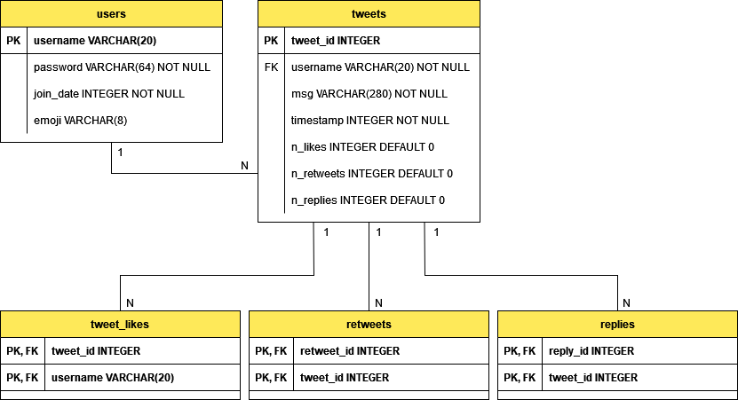
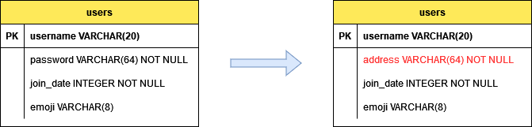

# web2to3twitter

```
Cartesi Rollups version: 0.8.x
```

This example has two implementations of the same application, Web 2 and Web 3. The purpose of these two implementations is to show that Cartesi Rollups allows the developer to build a DApp as complex as Web 2 applications while maintaining a technical stack familiar to Web 2 developers. Using the same stack to develop also minimizes the learning curve and makes it possible to reuse the code already developed.

The example consists of a possible implementation of a Twitter application using SQLite, where users can create an account and interact with the application similarly to Twitter. A logged user can tweet, retweet, reply, and like or un-like a tweet through a web interface served by a Python server and developed in Javascript. The mentioned features are all implemented based on the relational database schema below.



Renaming the "password" column to "address" in the "users" table was the only change made in the database schema for the Web 3 version, as shown in the Figure below. Since a layer-1 account address uniquely identifies a user, the username works only as an alias in the Web 3 version. Note that the column's data type remains the same, and the database model didn't really change. Also, note that the alias is unique, so it can't have two users with the same name, but a layer-1 account can have several DApp accounts with different usernames.

